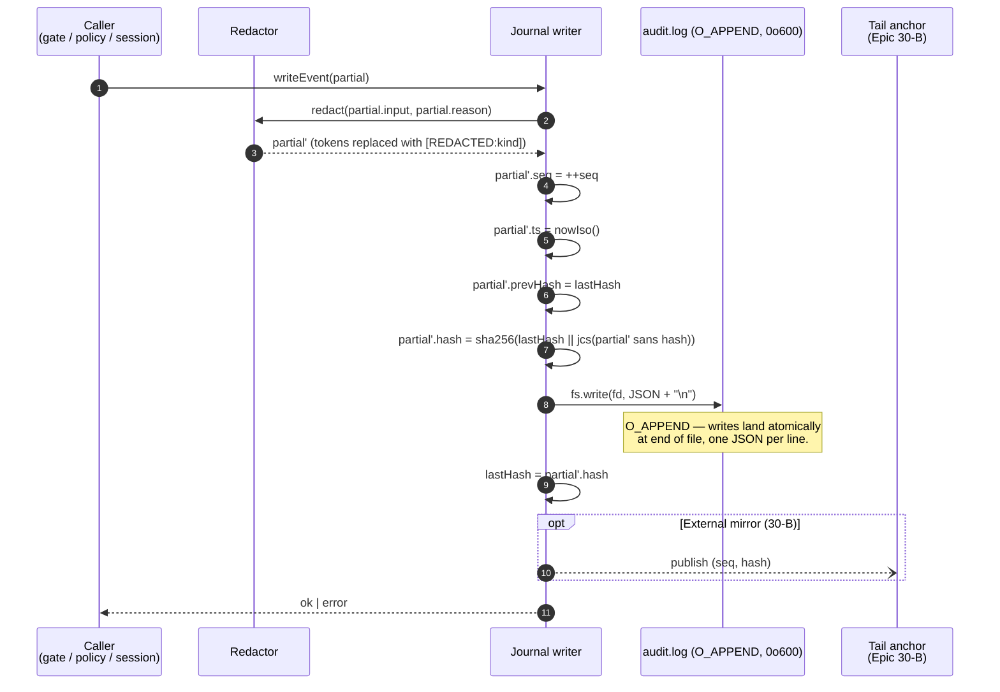

# Audit Journal Architecture

Design reference for the journal sink named in
[`../ARCHITECTURE.md`](../ARCHITECTURE.md) and implemented by **Epic 30-A**
(ccsc-5pi) for v0.4.1 and Epic 30-B for v0.5.0+. This document fixes the
append format, hash-chain semantics, redaction rules, and verification
command before any code lands, so 30-A PRs can be reviewed against a frozen
record format.

The audit journal is the **only** component that sees every
security-relevant event the plugin handles: inbound gate drops, outbound
gate refusals, policy decisions, session transitions, exfil-guard hits,
pairing events. Losing the journal loses the post-hoc forensic surface —
so the journal is write-once, append-only, hash-chained, and careful about
what it stores.

---

## JournalEvent schema

```ts
interface JournalEvent {
  v:        1                              // schema version; bump on incompatible change
  ts:       string                         // ISO-8601 UTC with ms precision; monotonic counter disambiguates ties
  seq:      number                         // monotonic per-process; never resets within a chain
  kind:     EventKind                      // see table below
  toolName?:string                         // when kind involves a tool call
  input?:   Record<string, unknown>        // redacted tool-call args
  outcome?: 'allow' | 'deny' | 'require' | 'drop' | 'n/a'
  reason?:  string                         // short, human-readable; no PII, no secrets
  ruleId?:  string                         // for policy decisions
  sessionKey?: { channel: string; thread: string }
  actor?:   'session_owner' | 'claude_process' | 'human_approver' | 'peer_agent' | 'system'
  correlationId?: string                   // links related events (Dapper-style)
  prevHash: string                         // sha256 hex of the previous event's serialized form
  hash:     string                         // sha256 hex of (prevHash || canonicalJson(event_without_hash))
}

type EventKind =
  | 'gate.inbound.deliver'
  | 'gate.inbound.drop'
  | 'gate.outbound.allow'
  | 'gate.outbound.deny'
  | 'policy.allow'
  | 'policy.deny'
  | 'policy.require'
  | 'policy.approved'
  | 'exfil.block'
  | 'session.activate'
  | 'session.quiesce'
  | 'session.deactivate'
  | 'session.quarantine'
  | 'pairing.issued'
  | 'pairing.accepted'
  | 'pairing.expired'
  | 'system.boot'
  | 'system.shutdown'
  | 'system.reload'
```

Three cuts worth highlighting:

- **`v: 1`** is the only way we'll ever introduce an incompatible shape.
  Verification tools refuse mixed versions in one chain.
- **`seq`** lets us detect dropped writes even when `ts` collisions are
  within clock resolution. A missing `seq` between two events is a
  tamper signal during verification.
- **`correlationId`** is the Dapper-style thread that links, e.g., a
  single tool call's `policy.require` → `pairing.issued` →
  `pairing.accepted` → `policy.approved` → `gate.outbound.allow`.
  Sampling of correlated event chains is what makes the journal useful
  under volume.

---

## Hash chain (Schneier & Kelsey, 1999)

```
hash_n = sha256(hash_{n-1} || canonical_json(event_n without 'hash'))
hash_0 = sha256(TRUSTED_ANCHOR)
```

`TRUSTED_ANCHOR` is a per-chain random value written as the payload of the
very first `system.boot` event. The anchor is part of the event body, so
it cannot be forged without discovering it from the journal itself.

**Why SHA-256, not an HMAC?** An HMAC would require a key accessible to
the writer and to the verifier. The writer is the same process that wrote
every event, and the verifier is a separate tool run by a human — sharing
a key between them is fragile. The chain property (any edit breaks the
next hash) is enough for tamper detection; post-fact confidentiality of
the journal is not what we're after.

`canonicalJson()` is the standard JCS (RFC 8785) form so two independent
implementations compute the same hash.

### What tampering does and does not detect

Detects:

- Edit of any event's body → `hash` no longer matches → verify fails at
  that event.
- Reorder of any two events → `prevHash` chain breaks.
- Insertion of a forged event → `prevHash` of the event after insertion
  mismatches.

Does **not** detect:

- **Truncation of the tail** (the last N events deleted). Nothing in
  events 1..N-M-1 points forward to N-M..N, so the chain is valid up to
  where it stops. Mitigations:
  - External log forwarding (Epic 30-B) — tail is mirrored off-host.
  - Trusted-anchor publication — periodically, the latest `(seq, hash)`
    pair is written to a second sink (e.g., a pinned gist or a syslog
    receiver) so a truncation leaves the anchor dangling.
- **Complete journal deletion** — out of scope; at that point the
  attacker has filesystem control and the journal is the wrong layer.

---

## Write path (sequence diagram)



The writer is a single struct (`JournalWriter`) with a mutex around the
increment-hash-write block. All callers serialize through it — the
order of operations matters, and re-entrancy would be a footgun. There
is exactly one `JournalWriter` per process.

File handling:

- Opened once at boot with `O_APPEND | O_WRONLY | O_CREAT`, mode `0o600`.
- `O_APPEND` means concurrent writers on POSIX append atomically; we
  still serialize for the hash chain, not for write safety.
- On rotation signal (Epic 30-B), writer closes and reopens; the
  *new* file begins with a `system.reload` event whose `prevHash` is
  the last hash of the previous file — cross-file chain continuity.

---

## Redaction

Run *before* the event is hashed or written.

```ts
const TOKEN_PATTERNS: Array<{ kind: string; re: RegExp }> = [
  { kind: 'anthropic',  re: /sk-[a-zA-Z0-9-]{20,}/g },
  { kind: 'slack_bot',  re: /xoxb-[0-9]+-[0-9]+-[a-zA-Z0-9]+/g },
  { kind: 'slack_app',  re: /xapp-[0-9]+-[A-Z0-9]+-[0-9]+-[a-f0-9]+/g },
  { kind: 'github',     re: /\bghp_[A-Za-z0-9]{36}\b/g },
  { kind: 'aws_access', re: /\bAKIA[0-9A-Z]{16}\b/g },
  { kind: 'jwt',        re: /\beyJ[A-Za-z0-9_-]+\.eyJ[A-Za-z0-9_-]+\.[A-Za-z0-9_-]+\b/g },
]

function redact(v: unknown): unknown {
  // Deep-walk; replace each match with `[REDACTED:${kind}]`.
}
```

Applied to `input`, `reason`, and any nested string. Not applied to
top-level typed fields (`ts`, `seq`, `kind`, `hash`, …) — those never
carry secrets.

**What redaction does not do:**

- Does not guard against bespoke secrets (internal tokens, user
  messages that contain passwords). The operator is told explicitly
  that the journal may contain message content and must be stored at
  `0o600`.
- Does not claim fitness for compliance frameworks. This is a forensic
  record for one developer, not a SOC 2 audit trail.

**What redaction adds to the hash.** The redacted form is what's hashed,
because that's what ends up on disk. A verifier working from a copy of
the file cannot recover redacted tokens from the hash.

---

## Truncation

Long string values are truncated to a hard limit (default 2048 chars
per field) with a marker `[... truncated 12345 chars]` so the record
stays bounded. Truncation happens after redaction, so a half-truncated
token never appears on disk.

The original length is preserved in a sibling field (`<field>.len`) so
forensics can tell when a payload was large without seeing it.

---

## Projection to Slack (Epic 30-B, not 30-A)

In v0.4.1 the journal is **local only**. The `--audit-log-file` CLI flag
and `SLACK_AUDIT_LOG` env var set the destination; there is zero Slack
surface.

In v0.5.0+ a separate projection component reads the local journal and
forwards a filtered subset to an `#audit` channel, subject to the
outbound gate. The projection is explicitly *not* the source of truth
— the source of truth stays on disk, hash-chained, operator-owned.

Why separate the projection?

1. **The local log must survive Slack being unreachable.** If Slack is
   down, we still want the journal.
2. **The projection filters** — not every event makes sense in a chat
   channel. Filtering belongs in a dedicated transform, not muddled
   into the writer.
3. **The projection can be disabled** without losing anything; the
   journal is primary.

---

## Verification command

Epic 30-A ships `verifyJournal(path)` as an exported function from
`journal.ts`. Behavior:

1. Read the file line-by-line, parse each as JSON.
2. Reject if schema versions differ or the event fails strict
   `JournalEvent` validation.
3. For each event, recompute
   `expected = sha256(prevHash || jcs(event sans hash))` and compare.
4. On any break, return a `VerifyResult` with `ok: false` and a
   `break` describing `lineNumber`, `seq`, `ts`, `reason`, and — when
   applicable — `expected` / `actual` hashes. The function never
   modifies the file.
5. On success return `{ ok: true, eventsVerified: N }`.

### Example 3-line log

A minimal intact chain — each `prevHash` equals the previous event's
`hash`, and `seq` increments by one. (Hashes truncated for
readability; real entries are 64-char hex.)

```jsonl
{"v":1,"seq":1,"ts":"2026-04-19T18:57:00.100Z","kind":"system.boot","actor":"system","prevHash":"0000…0000","hash":"a1b2…c3d4"}
{"v":1,"seq":2,"ts":"2026-04-19T18:57:00.420Z","kind":"gate.inbound.deliver","actor":"system","sessionKey":{"channel":"C01","thread":"17..."},"prevHash":"a1b2…c3d4","hash":"5e6f…7890"}
{"v":1,"seq":3,"ts":"2026-04-19T18:57:01.015Z","kind":"gate.outbound.allow","actor":"claude_process","sessionKey":{"channel":"C01","thread":"17..."},"prevHash":"5e6f…7890","hash":"9abc…def0"}
```

Any edit to any field in line 2 changes its recomputed `hash` —
verification fails at line 2. Reordering lines 2 and 3 makes line 3's
`prevHash` no longer equal line 2's new `hash` — verification fails
at line 3. Deleting line 3 silently (tail truncation) is **not**
detected by the chain alone; see §107-115 for why, and Epic 30-B for
the external-anchor mitigation.

### CLI (`--verify-audit-log`)

Epic 30-A.15 wires `verifyJournal()` as a `server.ts` subcommand. The
intercept runs before any state setup — no `.env`, no `STATE_DIR`, no
Slack client needed. An operator can copy a journal off the host and
verify it from anywhere the repo is checked out.

```bash
bun server.ts --verify-audit-log ~/.claude/channels/slack/audit.log
```

Output contract (stable — operators may grep):

- Success: `OK: <N> event(s) verified in <path>` on stdout.
- Break: multi-line `FAIL:` block on stderr with `line:`, `seq:`, `ts:`,
  `reason:`, plus `expected:` / `actual:` when applicable and an
  `events verified before break:` tail for truncation forensics.

Exit codes:

- `0` — chain intact end-to-end.
- `1` — chain break (hash mismatch, `prevHash` mismatch, `seq` gap,
  schema violation, version skew, or parse error).
- `2` — unexpected error in the verifier itself (should not happen in
  production; surfaced for operator visibility over a silent success).

---

## Storage and rotation

- One file: `<SLACK_AUDIT_LOG or --audit-log-file>` or
  `~/.claude/channels/slack/audit.log`.
- Mode `0o600`.
- Rotation: Epic 30-B, based on file size or external signal. Each
  rotated file is written with a `system.reload` event whose
  `prevHash` ties it to the previous file.
- No retention policy in the plugin — operator decides when to archive.

---

## Relationship to other subsystems

- **Inbound gate** calls `writeEvent({kind: 'gate.inbound.drop', ...})`
  on every rejected event. Drops are journaled even though they never
  reach Claude — this is how we see attack attempts.
- **Outbound gate** journals every reply attempt, allowed or refused.
- **Policy evaluator** has no journal dependency; the caller emits the
  decision event.
- **Session supervisor** emits activate/quiesce/deactivate/quarantine
  events. Quarantine also files a bead (separate subsystem).
- **Pairing flow** emits issued/accepted/expired.

The journal is read-only to every other component except its own
writer. No one else opens the file.

---

## Pairing events (ccsc-rc1 / ccsc-scv)

The journal declares three `pairing.*` event kinds. Wiring them into the
running server is not uniform, because pairing state lives in
`access.json` and two of the three lifecycle transitions happen outside
the server process. The table below pins the emission site for each.

| Event | Trigger | Emission site | Ships in |
|---|---|---|---|
| `pairing.issued` | Unknown Slack user DMs the bot; server allocates a pending code | `server.ts` pair-handler in `handleMessage` | v0.5.0 |
| `pairing.expired` | `pending[code].expiresAt <= Date.now()` on next `getAccess()` | `server.ts getAccess()` after `pruneExpired()` | ccsc-rc1 (PR #149) |
| `pairing.accepted` | `/slack-channel:access pair <code>` adds the sender to `allowFrom` | `server.ts getAccess()` via allowFrom snapshot diff | ccsc-scv |

### Why pairing.accepted needs a diff, not a direct emit

`/slack-channel:access pair <code>` is a Claude Code skill. It runs in
Claude's process space, not in the running MCP server's process. It
mutates `access.json` directly (atomic write, mode `0o600`) and the
server only observes the change on its next load. There is no IPC
channel from the skill back to the server, and inventing one would
introduce a new trust boundary for a single observational event.

Three designs were considered when scoping ccsc-scv:

1. **File-watcher** — `server.ts` installs `fs.watch` on `access.json`,
   diffs the prev/next state on each change event. Pros: responsive.
   Cons: `fs.watch` behavior varies across platforms and filesystems
   (FAT, SMB mounts, Docker bind-mounts), debouncing is required to
   collapse rename-tmp-to-target saves, and a broken watcher fails
   silently.
2. **Skill writes a journal-drain file** — the skill appends a
   `pairing.accepted` record to a sidecar file the server drains on
   startup and on demand. Pros: no race, no platform variance. Cons:
   introduces a second writer to the audit surface, complicates the
   hash-chain story (who seals the event?), and makes the skill itself
   a contributor to the append log.
3. **Relocate pairing into the server process** — skill becomes a thin
   CLI shim that signals the server (SIGUSR1 + staging file, named
   pipe, or local HTTP) to perform the mutation. Pros: single writer.
   Cons: largest surface area change; adds a new IPC attack vector
   with its own gate + authorization contract; inverts the current
   separation where the skill is the only thing that can approve
   pairings.

### The chosen approach: lazy snapshot diff in `getAccess()`

`server.ts getAccess()` already runs on every inbound message (it is
how the server observes `access.json` edits). The same hot path that
calls `pruneExpired()` and journals `pairing.expired` can hold a
module-level snapshot of the prior `allowFrom` set, compute the
difference against the current one, and emit one `pairing.accepted`
per newly-added user id.

Pseudocode (see `server.ts` for the real wiring):

```
let prevAllowFrom: ReadonlySet<string> | null = null

function getAccess() {
  const access = loadAccess()
  for (const [, entry] of pruneExpired(access)) journal(pairing.expired, ...)
  if (prevAllowFrom !== null) {
    for (const userId of detectNewAllowFrom(prevAllowFrom, access.allowFrom)) {
      journal(pairing.accepted, { user: userId })
    }
  }
  prevAllowFrom = new Set(access.allowFrom)
  return access
}
```

Properties this gives us:

- **Platform-agnostic.** No filesystem watcher; the existing `loadAccess()`
  round-trip carries the signal. Works on every supported platform and
  every filesystem layout.
- **First-call baseline.** The first `getAccess()` after boot seeds the
  snapshot without emitting events; this avoids spamming the journal
  with the entire pre-existing `allowFrom` on every process restart.
- **Tamper-resistant by construction.** The diff fires on any
  `allowFrom` growth, not just skill-driven additions. If an operator
  edits `access.json` by hand or an attacker tampers with the file,
  the server's next hot-path read sees the delta and records it. This
  is stronger than Options 2 or 3, which are skill-/IPC-scoped.
- **Lazy and bounded in latency.** Detection is gated by the next
  inbound message. In practice `getAccess()` runs within seconds of
  any meaningful activity, so the audit entry arrives close to the
  acceptance time. The event timestamp reflects detection, not
  acceptance; operators who need the exact acceptance moment read the
  `access.json` mtime in parallel.
- **Semantic on the event name.** `pairing.accepted` fires on any
  `allowFrom` addition, regardless of which path (pair code, `access
  add <user_id>`, or manual edit) caused it. In practice every
  production path goes through the skill, but the event name is a
  statement about the state transition, not the command that drove
  it. This keeps the implementation trivial and the invariant clear:
  *an `allowFrom` addition always produces exactly one
  `pairing.accepted`*.
- **Removal is silent.** Entries leaving `allowFrom` are not a pairing
  event; no `pairing.removed` kind exists and we do not invent one.
  The declared set stays at 19 kinds.

Edge cases the implementation handles:

- **Duplicates in the input array.** `access.allowFrom` is a `string[]`
  and callers are not required to deduplicate. The snapshot + diff use
  `Set` semantics, so a duplicate value never produces a second event.
- **Pre-existing entries at boot.** The first `getAccess()` call
  establishes the baseline by setting `prevAllowFrom = new Set(...)`
  before any comparison runs. Entries present at boot produce no
  events; only growth *after* boot is journaled.
- **Static mode.** `getAccess()` short-circuits to the frozen
  `staticAccess` without re-reading the file. In static mode the
  allowlist does not grow at runtime, so no diff is needed and none is
  performed.
- **Concurrent boot race.** The snapshot is initialized on the first
  `getAccess()` call, not at module load. The window between server
  boot and first message is a window where an acceptance would be
  missed — but this is identical to the `pairing.issued` behaviour
  (no events fire before the socket is up), so symmetry is preserved.

### The detection primitive

The pure diff is factored into `detectNewAllowFrom(prev, current)` in
`lib.ts`. It takes the prior snapshot (`ReadonlySet<string> | null`)
and the current `allowFrom` array, and returns the new user ids. When
`prev` is `null` (no baseline yet) it returns `[]` — the
first-call-seeds-baseline contract lives in this function rather than
in the server wiring.

---

## Non-goals

- **Not a log aggregator.** One host, one file.
- **Not a compliance-grade audit system.** The operator is a single
  developer; the threat model treats them as trusted.
- **Not a distributed append log.** No Raft, no external receipts (the
  trusted-anchor publication in 30-B is a one-line gist write, not a
  consensus protocol).
- **Not a metrics pipeline.** Events carry structure sufficient for
  forensics, not for dashboards.
- **Not deletable from the running process.** The writer does not
  expose a `truncate` or `delete` method. Operator removes files via
  the OS when they archive.

---

## Invariants

Every 30-A PR is checked against these.

1. Every security-relevant event flows through exactly one
   `JournalWriter`.
2. Redaction runs before hashing; the hashed form is the on-disk form.
3. `hash_n = sha256(prev_hash || jcs(event_n sans hash))`, SHA-256,
   JCS canonical JSON.
4. `seq` is monotonic per chain and never reset mid-file.
5. Writes are `O_APPEND` + newline-delimited JSON; one line = one
   event.
6. No module outside the writer opens the audit file for write.
7. Verification tool matches the write implementation bit-for-bit;
   both share the serializer.
8. Rotation, when it arrives in 30-B, preserves chain continuity via
   a `system.reload` event whose `prevHash` ties files together.

---

## References

- Schneier, B. & Kelsey, J. (1999). *Secure Audit Logs to Support
  Computer Forensics.* ACM TISSEC — hash-chain construction.
- Sigelman, B. et al. (2010). *Dapper, a Large-Scale Distributed
  Systems Tracing Infrastructure.* Google — correlation ID shape.
- RFC 8785 (2020). *JSON Canonicalization Scheme (JCS)* — serializer
  used for hashing.
- [`../ARCHITECTURE.md`](../ARCHITECTURE.md) — journal sink component
  definition.
- [`../000-docs/THREAT-MODEL.md`](THREAT-MODEL.md) — T8 (audit-log
  tampering).
- Bead **ccsc-hmj** — this document. Blocks Epic 30-A (ccsc-5pi).
- Epic 30-A children (ccsc-5pi.1 – ccsc-5pi.11) — implementation
  beads.
