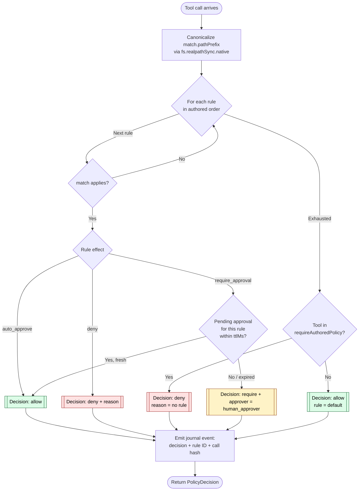
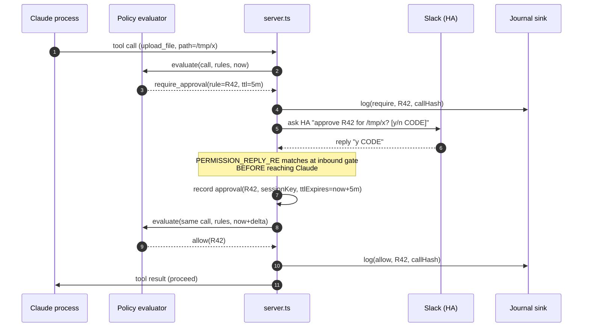

# Policy Evaluation Flow

Design reference for the policy evaluator named in
[`../ARCHITECTURE.md`](../ARCHITECTURE.md) and implemented by **Epic 29-A**
(ccsc-v1b) and Epic 29-B. This document fixes the evaluation semantics
before `policy.ts` is written, so 29-A PRs can be reviewed against a frozen
decision procedure.

A policy decides whether an MCP tool call proceeds, is denied, or requires
a human approver. The evaluator is **pure** — given a tool call, a policy
set, and the current time, it returns a decision with no side effects.
Side effects (asking for approval, journaling, denying) happen outside.

---

## Inputs and outputs

```ts
interface ToolCall {
  tool:     string                   // "reply" | "upload_file" | …
  input:    Record<string, unknown>  // validated args (after Zod at the MCP layer)
  sessionKey: SessionKey             // see 000-docs/session-state-machine.md
  actor:    Principal                // 'session_owner' | 'claude_process'
                                     //   approvers come in via a later turn
}

type PolicyDecision =
  | { kind: 'allow';   rule?: string }            // ID of the matching rule, if any
  | { kind: 'deny';    rule: string; reason: string }
  | { kind: 'require'; rule: string; approver: 'human_approver'; ttlMs: number }

function evaluate(
  call: ToolCall,
  policies: PolicyRule[],
  now: number,     // epoch ms
): PolicyDecision
```

The `actor` is the *direct* caller of the tool — almost always the Claude
process. Human approvals arrive as a later, separate turn (permission
reply) that flips a pending state; they are not inputs to `evaluate()`.

---

## PolicyRule schema (Zod)

```ts
const PolicyRule = z.discriminatedUnion('effect', [
  z.object({
    id:       z.string().min(1),
    effect:   z.literal('auto_approve'),
    match:    MatchSpec,
    priority: z.number().int().default(100),
  }),
  z.object({
    id:       z.string().min(1),
    effect:   z.literal('deny'),
    match:    MatchSpec,
    reason:   z.string().min(1),
    priority: z.number().int().default(100),
  }),
  z.object({
    id:       z.string().min(1),
    effect:   z.literal('require_approval'),
    match:    MatchSpec,
    ttlMs:    z.number().int().positive().default(5 * 60 * 1000),
    priority: z.number().int().default(100),
  }),
])

const MatchSpec = z.object({
  tool:       z.string().optional(),        // exact tool name
  pathPrefix: z.string().optional(),        // canonicalized via realpath before compare
  channel:    z.string().optional(),        // Slack channel ID
  actor:      z.enum(['session_owner', 'claude_process']).optional(),
  argEquals:  z.record(z.string(), z.unknown()).optional(),
}).refine(hasAtLeastOneField, 'match must constrain at least one field')
```

Three effects, first-applicable combining (see below). `priority` tie-breaks
within effect when two rules would otherwise be equivalent.

**Why no `allow_any_of`, `allow_if_*` forms?** Every extra combinator is
another place for a shadow. The three-effect schema is deliberately narrow;
compound logic is expressed by authoring multiple rules.

---

## Combining algorithm: first-applicable (XACML)

The evaluator scans the policy list in authored order and returns on the
first rule whose `match` matches the call. No scoring, no weighting, no
"most specific wins."

**Why first-applicable:**

1. **Readability under review.** An operator authoring rules by hand can
   predict the outcome by reading top-to-bottom. No mental model of
   "specificity."
2. **Bypass is visible.** If a later (stricter) rule is shadowed by an
   earlier (broader) one, the load-time linter surfaces the shadow as a
   warning. The operator sees *both* rules and can re-order.
3. **Monotonicity.** Appending a new rule at the end can never weaken the
   policy — a later rule only fires when every earlier rule misses. New
   rules are safe edits.

The default when no rule matches is **deny-by-omission** for tools listed
in `requireAuthoredPolicy`, and **allow** for others. The default set
starts as `['upload_file']`; it grows as dangerous tools are added.

### Why not deny-by-default for all?

An empty policy set would make the plugin unusable on first install. The
pragmatic split: tools whose *only* reason to exist is mutation of
external state (upload, post, delete) demand an authored rule; read-only
tools do not. The full list is in `policy.ts` next to the evaluator, not
in this doc (it changes with tool surface).

---

## Evaluation flow



Key properties of the diagram:

- **Single pass.** Each rule is evaluated at most once per call. No
  backtracking, no second pass.
- **Side-effect-free until the end.** The "journal event" node is emitted
  *after* the decision is determined; the evaluator itself does not write
  to any log. The caller (`server.ts`) forwards the decision to the
  journal sink.
- **Pending-approval check is a read, not a write.** A live approval for
  `(rule.id, sessionKey)` within `ttlMs` turns `require_approval` into
  `allow`. The approval record itself is written by the permission-reply
  handler, not by `evaluate()`.

---

## Path matching

Path-prefix matches are canonicalized before compare:

1. `call.input.path` is resolved to an absolute path via
   `path.resolve(process.cwd(), input.path)`.
2. The result is passed to `fs.realpathSync.native()` — this resolves
   every symlink.
3. `rule.match.pathPrefix` is resolved the same way (once, at load time,
   and cached).
4. Match is `resolvedInput.startsWith(resolvedPrefix + path.sep)` **or**
   `resolvedInput === resolvedPrefix`. The `+ path.sep` prevents
   `/etc/passwd` matching prefix `/etc/pass`.

**Why realpath at load time for the prefix?** If the operator writes a
rule against `/var/log/app` and `/var/log` is a symlink to `/srv/logs`,
the rule stays meaningful after a reorg only if we compare canonicalized
paths. The cost is that deleting or replacing a symlink after load
requires a reload. That tradeoff is spelled out in the operator docs.

**CWE-22 mitigation.** An attacker cannot smuggle a path through a symlink
because the match compares *resolved* paths. A `rule.match.pathPrefix` of
`/safe/dir` will never match `call.input.path = "/safe/dir/../../etc/passwd"`
— realpath collapses it to `/etc/passwd` and the prefix check fails.

---

## Shadow-detection linter

At load time (before the evaluator is ever called), a static linter scans
the policy list for shadows:

```
rule R_later is shadowed by R_earlier
  when every call that matches R_later also matches R_earlier
```

The linter uses a conservative subset-check over `MatchSpec` fields:

- `tool`: R_earlier.tool is undefined OR R_earlier.tool === R_later.tool
- `pathPrefix`: R_earlier.pathPrefix is a prefix of R_later.pathPrefix
  (both canonicalized)
- `channel`: same rule as `tool`
- `actor`: same rule as `tool`
- `argEquals`: R_earlier.argEquals is a subset of R_later.argEquals

If every field on `R_earlier` is less-specific-or-equal to the same field
on `R_later`, then `R_later` is shadowed and emits a warning:

```
policy-load: warning: rule 'deny-upload-env' (line 42) is shadowed by
  earlier rule 'auto-approve-all-uploads' (line 12) —
  reorder or narrow the earlier rule.
```

Warnings do **not** block startup; they go to stderr and the audit log.
Operators see them during local development and in CI. Fail-closed is
reserved for monotonicity violations.

---

## Monotonicity invariant

Across hot reloads, appending rules must never weaken policy for any
call. The check, run at load time against the *previous* policy hash:

```
for every rule R newly added in this load:
  if R.effect == 'auto_approve':
    confirm there is no earlier existing rule with effect 'deny' whose
      match is a superset of R.match.
```

If the check fails, the server **refuses** to adopt the new policy set
and keeps the previous one. The failure is logged and surfaces as a bead
for operator review. Fail-closed because a weakening reload is the
exact shape of an attack via operator coercion.

Removed or modified rules are not checked — removing a deny *does*
weaken policy, and the operator should know that when they author the
removal. The check catches only *accidental* weakening from additions.

---

## Approval flow integration

`require_approval` decisions flow through the existing permission-reply
machinery:



The approval is scoped to `(rule.id, sessionKey)` — a different session
in the same channel does not inherit the approval. The TTL starts at the
moment of approval, not the moment of request.

---

## Relationship to other subsystems

- **Inbound gate** runs before the evaluator. A denied inbound never
  reaches `evaluate()`. Gate handles *identity*; evaluator handles
  *action*.
- **Outbound gate** runs after the evaluator. Even an allowed tool call
  must still pass `assertOutboundAllowed()` / `assertSendable()`. The
  evaluator is **additional** authorization, never *sole* authorization.
- **Journal sink** receives every decision with the call hash and the
  rule ID. The journal is the audit trail for "why was this allowed?"
- **Session boundary** supplies `sessionKey`. The evaluator does not
  read or write session files.

The evaluator is never the only thing between an attacker and an action.
It is a *veto layer*, not the sole gate.

---

## Non-goals

- **Not a capability system.** Rules match on surface attributes (tool
  name, path prefix, channel, args). There is no delegation, no
  revocation ledger, no principal-to-principal capability passing.
- **Not a time-of-check-to-time-of-use (TOCTTOU) solution.** Path
  canonicalization at evaluate time is the honest mitigation; a race
  between `evaluate()` and the tool's actual `fs.open()` is not closed
  by policy. Tools that care (file upload) pass the canonicalized path
  straight through to `open()` with no re-resolution.
- **Not hot-reloaded on every config change.** Reload is explicit via
  SIGHUP or `/slack-channel:access` subcommand, so the monotonicity
  check runs at a known moment.
- **Not a DSL.** Rules are plain JSON, Zod-validated. No expressions,
  no conditionals, no functions. Add rules, not features.

---

## Invariants

Every 29-A PR is checked against these.

1. `evaluate()` has no side effects. Callers emit journal events.
2. First-applicable combining; rule list order is the decision procedure.
3. Path matching canonicalizes both sides via `realpathSync.native`.
4. Shadow-detection warns but does not block.
5. Monotonicity violations at load time fail closed.
6. Approvals are scoped to `(rule.id, sessionKey)`, never workspace-wide.
7. Default is allow unless the tool is in `requireAuthoredPolicy`.
8. The evaluator is never the sole gate; outbound gate runs after.

---

## References

- OASIS (2013). *eXtensible Access Control Markup Language (XACML)
  Version 3.0.* — first-applicable combining semantics.
- CWE-22: *Improper Limitation of a Pathname to a Restricted Directory
  ("Path Traversal")* — path canonicalization mitigation.
- Saltzer & Schroeder (1975). *The Protection of Information in Computer
  Systems.* — least-privilege / complete-mediation framing of the
  evaluator-as-veto-layer role.
- [`../ARCHITECTURE.md`](../ARCHITECTURE.md) — policy evaluator component.
- [`../000-docs/THREAT-MODEL.md`](THREAT-MODEL.md) — T1 (prompt injection)
  and T7 (permission-reply forgery) mitigations.
- [`../000-docs/session-state-machine.md`](session-state-machine.md) —
  `sessionKey` provenance.
- Bead **ccsc-nlr** — this document. Blocks Epic 29-A (ccsc-v1b).
- Epic 29-A (ccsc-v1b.1 – ccsc-v1b.6) — implementation beads.
