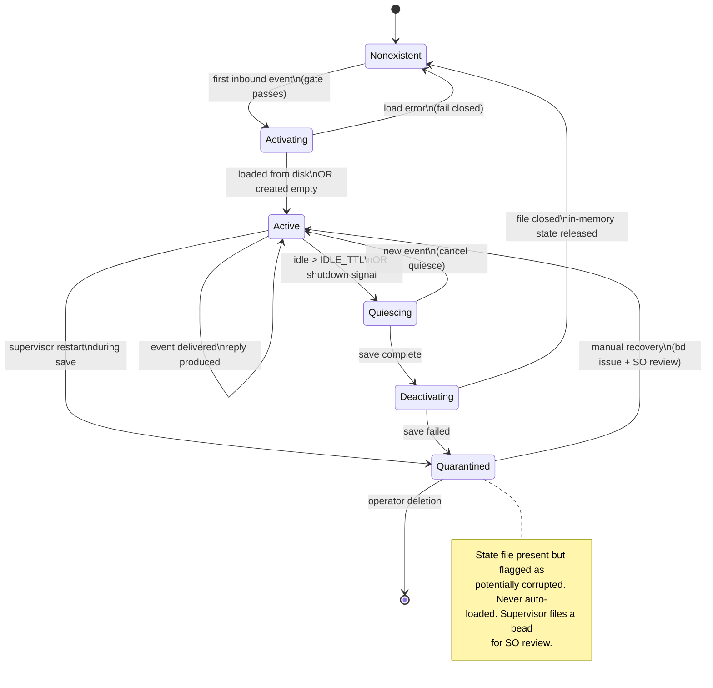
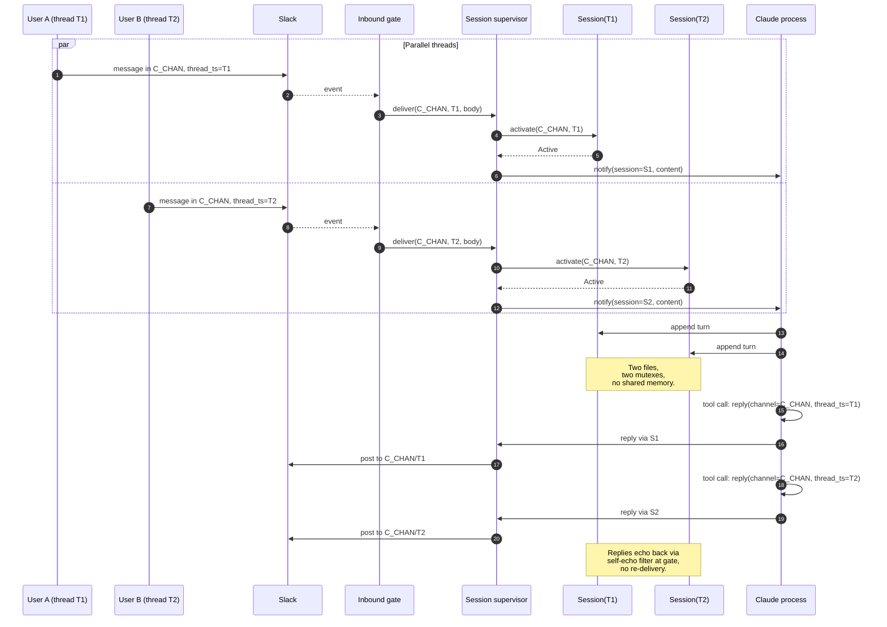

# Session State Machine

Design reference for the session boundary named in
[`../ARCHITECTURE.md`](../ARCHITECTURE.md) and the thread-scoped session work
in **Epic 32-A** (ccsc-z78) and Epic 32-B. This document fixes the lifecycle
and supervisor contract before any code lands, so Epic 32-A PRs can be
reviewed against a frozen spec.

A session is the unit of *conversation state*. One session corresponds to
one Slack thread — **not** one Slack channel. Two parallel threads in the
same channel have two independent sessions and never observe each other's
state.

---

## Identity

A session is keyed by a `SessionKey`:

```ts
interface SessionKey {
  channel: string     // Slack channel ID, e.g. "C0123456789" or "D0123456789" (DM)
  thread:  string     // thread_ts string, e.g. "1711000000.000100"
                      // For top-level (non-threaded) messages, thread === ts of the root message
}
```

Rationale for `thread` as part of the key:

- A user can run four parallel conversations with Claude in one Slack channel
  by replying in four separate threads. Each is a different task; each must
  carry its own rolling context.
- Slack's `event.thread_ts` is present on any event that is part of a thread.
  When absent (a top-level channel message), we synthesise thread = ts of the
  new message, so the first reply becomes the thread root naturally.
- DMs are a channel whose ID begins with `D`. The same rule applies — each
  new DM thread is its own session.

**Invariant:** `channel` and `thread` are both strings that arrive from
Slack. Neither is ever constructed from message content. A prompt-injected
`thread_ts: "../../.env"` is caught by the realpath guard in
`sessionPath()` below, but the *identity* primitive does not accept
user-authored values — it takes the Slack event's own fields.

---

## On-disk layout

Sessions live under the state directory at:

```
~/.claude/channels/slack/sessions/<channel>/<thread>.json
```

```ts
function sessionPath(root: string, key: SessionKey): string
```

`sessionPath()` constructs the path with three safety rules:

1. Every component is validated against `/^[A-Za-z0-9._-]+$/` **and**
   must not be the literal strings `.` or `..` — Slack IDs and `ts`
   strings satisfy this; anything else is rejected before joining. The
   regex alone admits `.` and `..`, both of which would escape the
   `sessions/` layer via `path.join` while still resolving inside the
   state root (so realpath containment would not catch them). Multi-dot
   strings like `...` stay allowed — `path.join` treats them as
   literals, not traversal operators.
2. The final joined path is resolved with `fs.realpathSync.native` on its
   parent directory, and the result must still have the state root as a
   prefix. This catches symlink smuggling (CWE-22).
3. The parent `sessions/<channel>/` directory is created with mode `0o700`
   on first use. Rules 2 and 3 are one primitive: the `mkdir` is what
   makes the `realpath` in Rule 2 resolvable. Splitting them would let a
   caller skip the `mkdir` and defeat the symlink check.

All files are written with mode `0o600`.

### Migration from flat layout (v0.4.x)

Pre-0.5.0 the plugin kept one file per channel (`sessions/<channel>.json`).
The migrator (`ccsc-z78.7`) runs once at boot:

- Finds each `sessions/*.json` that is a file (not a directory).
- Moves it to `sessions/<channel>/default.json` (atomic `rename`).
- Drops a `.migrated` marker so the migrator is a no-op on subsequent boots.

Existing conversations that predate thread-scoping surface as the
`default` thread and continue without context loss.

### Atomic writes

Every save path is:

```ts
async function saveSession(path: string, session: Session): Promise<void>
```

1. Serialize to JSON.
2. Write to `<path>.tmp.<pid>` with `{ mode: 0o600, flag: 'wx' }`.
3. `fs.rename(tmp, path)` — atomic on POSIX.
4. On error at any step, remove the tmp file and surface the error.

**Invariant:** no reader ever observes a partial session file. Either the
full new content or the full old content — nothing in between.

---

## State diagram



Five states:

- **Nonexistent** — no file, no memory. The default.
- **Activating** — server has accepted an inbound event, is loading or
  creating the file. Single-writer critical section.
- **Active** — file on disk is current, in-memory handle is live. Reads and
  writes go through here.
- **Quiescing** — graceful drain: no new events accepted for this session,
  pending writes flushing.
- **Deactivating** — file closed, memory released. Any future inbound for
  this key re-enters Activating.
- **Quarantined** — error state. Only a human (SO) can clear it.

Transitions are strict: no edge exists unless drawn above. In particular
there is no `Active → Nonexistent` shortcut — every teardown goes through
Quiescing so the final save lands.

---

## Concurrent threads (sequence diagram)

Two users reply in two different threads in the same channel at the same
wall time. Both get their own session. Neither ever observes the other's
state.



Three invariants this diagram pins down:

1. **One mutex per session file**, not per channel. Two threads in the
   same channel never serialize against each other.
2. **Replies carry `thread_ts`**. The outbound gate asserts the reply
   `thread_ts` matches a delivered inbound `thread_ts` — so a reply
   cannot be smuggled into the channel's top-level timeline.
3. **Self-echo suppression is session-aware**. The server's own reply
   comes back through the Socket Mode WebSocket; the gate drops it *and*
   the session supervisor does not double-append it.

---

## Supervisor contract (Armstrong-style)

The session supervisor is the only component that creates, transitions, or
destroys sessions. No other code in `server.ts` or `lib.ts` may write a
session file directly.

### Responsibilities

- Maintain a `Map<SessionKey, SessionHandle>` of live sessions.
- On incoming delivered event: ensure session is `Active`, deliver.
- On outbound reply: ensure session exists, write turn, release mutex.
- On idle timeout: trigger `Quiescing → Deactivating`.
- On process shutdown (`SIGTERM` / `SIGINT`): quiesce every live session,
  wait for flushes, exit.
- On save failure: mark session `Quarantined`, file a beads issue noting
  `(channel, thread, error, timestamp)`, continue serving *other* sessions.

### Restart semantics

The supervisor crashes or is restarted. What survives?

- **On-disk file** — survives. Source of truth for all persistent state.
- **In-memory handle** — lost. Next inbound for that key re-enters
  Activating and re-reads the file.
- **Pending permission requests** — lost. The sender is told (via a Slack
  reply) that their approval timed out; they must re-issue. The audit log
  records the loss.

The supervisor is **not** responsible for:

- Deciding whether an event is allowed to reach Claude — that's the
  inbound gate.
- Deciding whether a tool call runs — that's the policy evaluator
  (Epic 29-A).
- Persisting the audit log — that's the journal sink (Epic 30-A).

### Failure modes

| Failure                                 | Response                                                             |
|-----------------------------------------|----------------------------------------------------------------------|
| `saveSession()` throws                  | Session → Quarantined, event still delivered in-memory, bead filed. |
| `loadSession()` throws on existing file | Session → Quarantined, inbound dropped with journal entry.          |
| Realpath check fails                    | Reject at `sessionPath()`; never reaches activation.                 |
| `sessions/<channel>/` creation denied   | Reject, log, surface error to operator. No session loss on a path we never wrote. |
| Idle TTL expires mid-quiesce            | Complete the quiesce; do not re-extend.                              |
| Two activations race on same key        | Single-flight — second waiter receives the first's `SessionHandle`. |

---

## Relationship to the policy evaluator and journal sink

The session is *only* state. It does not evaluate rules, it does not
decide who can speak, it does not log decisions.

- **Policy evaluator** (`policy.ts`, Epic 29-A) reads session state as an
  *input* to decisions (e.g., "this thread has an approved high-risk tool
  call for the next 5 minutes"). It never writes session state.
- **Journal sink** (Epic 30-A) receives events from the session supervisor
  — activation, quiesce, deactivate, quarantine — as structured events. It
  does not mutate session files.

Keeping these three subsystems clean lets each be tested independently.

---

## Operator-visible surface

What changes for the session owner when 32-A ships?

- Existing `~/.claude/channels/slack/sessions/<channel>.json` files are
  migrated to `sessions/<channel>/default.json`.
- New directory structure is 0o700; files remain 0o600.
- Quarantined sessions surface as open beads the operator can triage.
- `/slack-channel:access status` gains a line showing the count of
  live sessions and quarantined sessions.

Existing conversation history is preserved. No re-pairing required.

---

## Non-goals

- **Not a session store for multiple Claude processes.** One plugin
  instance per state dir. If the operator runs two Claude processes
  concurrently against the same state dir, behavior is undefined — the
  state dir is single-writer.
- **Not a conversation memory system.** Sessions hold message history and
  per-thread book-keeping the MCP server needs to do its job. Long-term
  memory is Claude's responsibility, not the plugin's.
- **Not multi-user.** `allowFrom` lists may grow, but there is still one
  session per (channel, thread), regardless of how many humans post into
  it.

---

## Invariants

Every 32-A PR is checked against these. Drift is a review block.

1. `SessionKey` is `(channel, thread)` — never `(channel)` alone, never
   constructed from message body.
2. `sessionPath()` passes a realpath check; the state dir is a prefix of
   the resolved path.
3. Saves are atomic: `tmp + chmod 0o600 + rename`.
4. Every state transition in the diagram above is the only way to reach
   the target state. No shortcuts.
5. Crash recovery reads from disk — there is no in-memory truth that can
   disagree with the file.
6. Two threads in one channel never share a mutex.
7. Replies carry `thread_ts`; the outbound gate enforces match.
8. Quarantine files a beads issue; operator sees it in `bd ready`.

---

## References

- Armstrong, J. (2003). *Making reliable distributed systems in the
  presence of software errors.* PhD thesis — supervisor / lifecycle shape.
- [`../ARCHITECTURE.md`](../ARCHITECTURE.md) — session boundary component
  definition.
- [`../000-docs/THREAT-MODEL.md`](THREAT-MODEL.md) — state-primitive attack
  surface (T5).
- Bead **ccsc-1gk** — this document. Blocks Epic 32-A (ccsc-z78).
- Epic 32-A (ccsc-z78.1 – ccsc-z78.10) — implementation beads.
