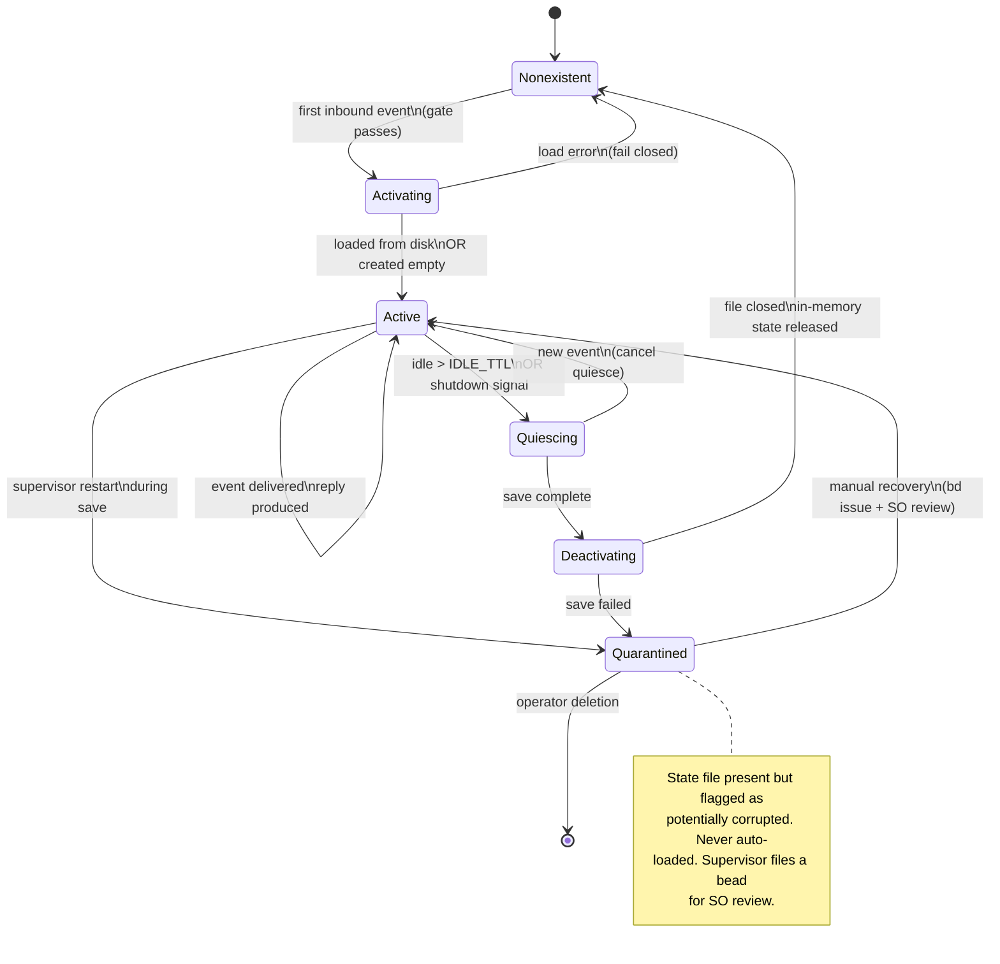
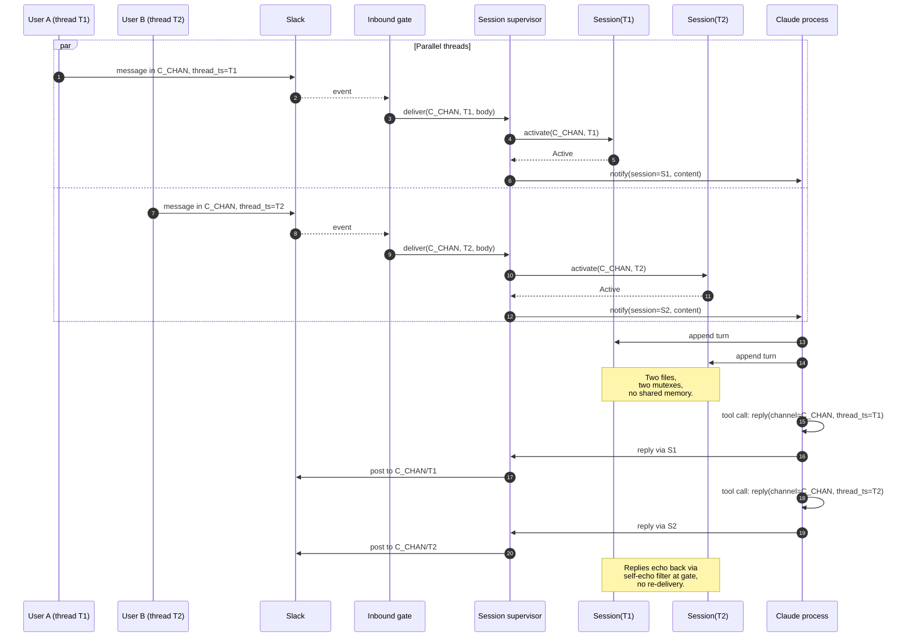

# Session State Machine

Design reference for the session boundary named in
[`../ARCHITECTURE.md`](../ARCHITECTURE.md) and the thread-scoped session work
in **Epic 32-A** (ccsc-z78) and Epic 32-B. This document fixes the lifecycle
and supervisor contract before any code lands, so Epic 32-A PRs can be
reviewed against a frozen spec.

A session is the unit of *conversation state*. One session corresponds to
one Slack thread — **not** one Slack channel. Two parallel threads in the
same channel have two independent sessions and never observe each other's
state.

---

## Identity

A session is keyed by a `SessionKey`:

```ts
interface SessionKey {
  channel: string     // Slack channel ID, e.g. "C0123456789" or "D0123456789" (DM)
  thread:  string     // thread_ts string, e.g. "1711000000.000100"
                      // For top-level (non-threaded) messages, thread === ts of the root message
  userId?: string     // (ccsc-kl410) opt-in per-user isolation. When a channel sets
                      // perUserSessions, the sender's Slack user_id is added so two
                      // humans in one thread get separate sessions. Absent = the
                      // legacy shared per-(channel, thread) session (the default).
}
```

When `userId` is present the on-disk file nests one level deeper —
`sessions/<channel>/<userId>/<thread>.json` — and the supervisor's `keyId`
appends the userId segment, so a per-user session can never collide with the
shared key. The `userId` component passes the same `isValidSessionComponent`
guard as `channel`/`thread` (no path traversal).

Rationale for `thread` as part of the key:

- A user can run four parallel conversations with Claude in one Slack channel
  by replying in four separate threads. Each is a different task; each must
  carry its own rolling context.
- Slack's `event.thread_ts` is present on any event that is part of a thread.
  When absent (a top-level channel message), we synthesise thread = ts of the
  new message, so the first reply becomes the thread root naturally.
- DMs are a channel whose ID begins with `D`. The same rule applies — each
  new DM thread is its own session.

**Invariant:** `channel` and `thread` are both strings that arrive from
Slack. Neither is ever constructed from message content. A prompt-injected
`thread_ts: "../../.env"` is caught by the realpath guard in
`sessionPath()` below, but the *identity* primitive does not accept
user-authored values — it takes the Slack event's own fields.

---

## On-disk layout

Sessions live under the state directory at:

```
~/.claude/channels/slack/sessions/<channel>/<thread>.json
```

```ts
function sessionPath(root: string, key: SessionKey): string
```

`sessionPath()` constructs the path with three safety rules:

1. Every component is validated against `/^[A-Za-z0-9._-]+$/` **and**
   must not be the literal strings `.` or `..` — Slack IDs and `ts`
   strings satisfy this; anything else is rejected before joining. The
   regex alone admits `.` and `..`, both of which would escape the
   `sessions/` layer via `path.join` while still resolving inside the
   state root (so realpath containment would not catch them). Multi-dot
   strings like `...` stay allowed — `path.join` treats them as
   literals, not traversal operators.
2. The final joined path is resolved with `fs.realpathSync.native` on its
   parent directory, and the result must still have the state root as a
   prefix. This catches symlink smuggling (CWE-22).
3. The parent `sessions/<channel>/` directory is created with mode `0o700`
   on first use. Rules 2 and 3 are one primitive: the `mkdir` is what
   makes the `realpath` in Rule 2 resolvable. Splitting them would let a
   caller skip the `mkdir` and defeat the symlink check.

All files are written with mode `0o600`.

### Migration from flat layout (v0.4.x)

Pre-0.5.0 the plugin kept one file per channel (`sessions/<channel>.json`).
The migrator (`ccsc-z78.7`) runs once at boot:

- Finds each `sessions/*.json` that is a file (not a directory).
- Moves it to `sessions/<channel>/default.json` (atomic `rename`).
- Drops a `.migrated` marker so the migrator is a no-op on subsequent boots.

Existing conversations that predate thread-scoping surface as the
`default` thread and continue without context loss.

### Atomic writes

Every save path is:

```ts
async function saveSession(path: string, session: Session): Promise<void>
```

1. Serialize to JSON.
2. Write to `<path>.tmp.<pid>` with `{ mode: 0o600, flag: 'wx' }`.
3. `fs.rename(tmp, path)` — atomic on POSIX.
4. On error at any step, remove the tmp file and surface the error.

**Invariant:** no reader ever observes a partial session file. Either the
full new content or the full old content — nothing in between.

---

## State diagram


```mermaid
stateDiagram-v2
    [*] --> Nonexistent

    Nonexistent --> Activating: first inbound event\n(gate passes)
    Activating --> Active: loaded from disk\nOR created empty
    Activating --> Nonexistent: load error\n(fail closed)

    Active --> Quiescing: idle > IDLE_TTL\nOR shutdown signal
    Active --> Active: event delivered\nreply produced
    Active --> Quarantined: supervisor restart\nduring save

    Quiescing --> Deactivating: save complete
    Quiescing --> Active: new event\n(cancel quiesce)

    Deactivating --> Nonexistent: file closed\nin-memory state released
    Deactivating --> Quarantined: save failed

    Quarantined --> Active: manual recovery\n(bd issue + SO review)
    Quarantined --> [*]: operator deletion

    note right of Quarantined
      State file present but flagged as
      potentially corrupted. Never auto-
      loaded. Supervisor files a bead
      for SO review.
    end note
```

Five states:

- **Nonexistent** — no file, no memory. The default.
- **Activating** — server has accepted an inbound event, is loading or
  creating the file. Single-writer critical section.
- **Active** — file on disk is current, in-memory handle is live. Reads and
  writes go through here.
- **Quiescing** — graceful drain: no new events accepted for this session,
  pending writes flushing.
- **Deactivating** — file closed, memory released. Any future inbound for
  this key re-enters Activating.
- **Quarantined** — error state. Only a human (SO) can clear it.

Transitions are strict: no edge exists unless drawn above. In particular
there is no `Active → Nonexistent` shortcut — every teardown goes through
Quiescing so the final save lands.

---

## Concurrent threads (sequence diagram)

Two users reply in two different threads in the same channel at the same
wall time. Both get their own session. Neither ever observes the other's
state.


```mermaid
sequenceDiagram
    autonumber
    participant U1 as User A (thread T1)
    participant U2 as User B (thread T2)
    participant Slack
    participant GA as Inbound gate
    participant SUP as Session supervisor
    participant S1 as Session(T1)
    participant S2 as Session(T2)
    participant CC as Claude process

    par Parallel threads
        U1->>Slack: message in C_CHAN, thread_ts=T1
        Slack-->>GA: event
        GA->>SUP: deliver(C_CHAN, T1, body)
        SUP->>S1: activate(C_CHAN, T1)
        S1-->>SUP: Active
        SUP->>CC: notify(session=S1, content)
    and
        U2->>Slack: message in C_CHAN, thread_ts=T2
        Slack-->>GA: event
        GA->>SUP: deliver(C_CHAN, T2, body)
        SUP->>S2: activate(C_CHAN, T2)
        S2-->>SUP: Active
        SUP->>CC: notify(session=S2, content)
    end

    CC->>S1: append turn
    CC->>S2: append turn
    Note over S1,S2: Two files,<br/>two mutexes,<br/>no shared memory.

    CC->>CC: tool call: reply(channel=C_CHAN, thread_ts=T1)
    CC->>SUP: reply via S1
    SUP->>Slack: post to C_CHAN/T1

    CC->>CC: tool call: reply(channel=C_CHAN, thread_ts=T2)
    CC->>SUP: reply via S2
    SUP->>Slack: post to C_CHAN/T2

    Note over S1,S2: Replies echo back via<br/>self-echo filter at gate,<br/>no re-delivery.
```

Three invariants this diagram pins down:

1. **One mutex per session file**, not per channel. Two threads in the
   same channel never serialize against each other.
2. **Replies carry `thread_ts`**. The outbound gate asserts the reply
   `thread_ts` matches a delivered inbound `thread_ts` — so a reply
   cannot be smuggled into the channel's top-level timeline.
3. **Self-echo suppression is session-aware**. The server's own reply
   comes back through the Socket Mode WebSocket; the gate drops it *and*
   the session supervisor does not double-append it.

---

## Supervisor contract (Armstrong-style)

The session supervisor is the only component that creates, transitions, or
destroys sessions. No other code in `server.ts` or `lib.ts` may write a
session file directly.

### Responsibilities

- Maintain a `Map<SessionKey, SessionHandle>` of live sessions.
- On incoming delivered event: ensure session is `Active`, deliver.
- On outbound reply: ensure session exists, write turn, release mutex.
- On idle timeout: trigger `Quiescing → Deactivating`.
- On process shutdown (`SIGTERM` / `SIGINT`): quiesce every live session,
  wait for flushes, exit.
- On save failure: mark session `Quarantined`, file a beads issue noting
  `(channel, thread, error, timestamp)`, continue serving *other* sessions.

### Restart semantics

The supervisor crashes or is restarted. What survives?

- **On-disk file** — survives. Source of truth for all persistent state.
- **In-memory handle** — lost. Next inbound for that key re-enters
  Activating and re-reads the file.
- **Pending permission requests** — lost. The sender is told (via a Slack
  reply) that their approval timed out; they must re-issue. The audit log
  records the loss.

The supervisor is **not** responsible for:

- Deciding whether an event is allowed to reach Claude — that's the
  inbound gate.
- Deciding whether a tool call runs — that's the policy evaluator
  (Epic 29-A).
- Persisting the audit log — that's the journal sink (Epic 30-A).

### Failure modes

| Failure                                 | Response                                                             |
|-----------------------------------------|----------------------------------------------------------------------|
| `saveSession()` throws                  | Session → Quarantined, event still delivered in-memory, bead filed. |
| `loadSession()` throws on existing file | Session → Quarantined, inbound dropped with journal entry.          |
| Realpath check fails                    | Reject at `sessionPath()`; never reaches activation.                 |
| `sessions/<channel>/` creation denied   | Reject, log, surface error to operator. No session loss on a path we never wrote. |
| Idle TTL expires mid-quiesce            | Complete the quiesce; do not re-extend.                              |
| Two activations race on same key        | Single-flight — second waiter receives the first's `SessionHandle`. |

---

## Relationship to the policy evaluator and journal sink

The session is *only* state. It does not evaluate rules, it does not
decide who can speak, it does not log decisions.

- **Policy evaluator** (`policy.ts`, Epic 29-A) reads session state as an
  *input* to decisions (e.g., "this thread has an approved high-risk tool
  call for the next 5 minutes"). It never writes session state.
- **Journal sink** (Epic 30-A) receives events from the session supervisor
  — activation, quiesce, deactivate, quarantine — as structured events. It
  does not mutate session files.

Keeping these three subsystems clean lets each be tested independently.

---

## Operator-visible surface

What changes for the session owner when 32-A ships?

- Existing `~/.claude/channels/slack/sessions/<channel>.json` files are
  migrated to `sessions/<channel>/default.json`.
- New directory structure is 0o700; files remain 0o600.
- Quarantined sessions surface as open beads the operator can triage.
- `/slack-channel:access status` gains a line showing the count of
  live sessions and quarantined sessions.

Existing conversation history is preserved. No re-pairing required.

---

## Non-goals

- **Not a session store for multiple Claude processes.** One plugin
  instance per state dir. If the operator runs two Claude processes
  concurrently against the same state dir, behavior is undefined — the
  state dir is single-writer.
- **Not a conversation memory system.** Sessions hold message history and
  per-thread book-keeping the MCP server needs to do its job. Long-term
  memory is Claude's responsibility, not the plugin's.
- **Not multi-user by default.** `allowFrom` lists may grow, but the default is
  still one session per (channel, thread), regardless of how many humans post
  into it. A channel may **opt in** to per-user isolation (`perUserSessions`,
  ccsc-kl410): each sender then gets their own session (own state file,
  supervisor handle, and `ownerId`) within the shared thread. This is bridge-
  session isolation — separate per-thread book-keeping per user — not a change
  to Claude's own conversation memory.

---

## ACP-mapping (ccsc-21x)

The [Agent Client Protocol (ACP)](https://agentclientprotocol.com/protocol/prompt-turn)
is the converging cross-ecosystem JSON-RPC 2.0 standard for agent
control. CCSC adopts ACP **additively only** — the supervisor's internal
vocabulary (`activate` / `quiesce` / `deactivate` / `quarantine`) is
unchanged. A single boundary adapter in `server.ts` translates ACP
envelopes onto existing supervisor methods.

The adapter is the ONLY place ACP terminology appears in this codebase.
A vocabulary rename would break ~704 tests and the meaning of every
existing entry in `audit.log` files in the field. The additive shape
also means upstream (`anthropics/claude-code#53049`) shipping external
message injection is a single-function-edit migration, not a rewrite.

### `session/cancel` → `supervisor.quiesce(key)`

| ACP envelope | CCSC internal | Notes |
|---|---|---|
| `method: "session/cancel"` | `supervisor.quiesce(key)` | Cooperative interrupt. The supervisor's promise resolves only after every in-flight save settles, matching ACP's "agent acknowledges with `cancelled` stop reason" shape. |
| `params.sessionId` (opaque string) | `{ channel, thread }` parsed from `"<channel>:<thread>"` | Slack channel and thread IDs contain only alphanumerics and dots — `':'` is an unambiguous delimiter. |
| `result.stopReason: "cancelled"` (success) | quiesce promise resolved | Adapter returns the ACP success envelope after the supervisor finishes. |
| `error.code: -32600` Invalid Request | request shape failed Zod validation | Spec-compliant fallback id is `null` when the envelope is malformed. |
| `error.code: -32602` Invalid params | sessionId missing colon, leading colon, or trailing colon | Surfaces the precise error code before the supervisor sees a malformed key. |
| `error.code: -32603` Internal error | `supervisor.quiesce()` rejected (quarantined, save failure) | Reason captured in `error.data.reason`. |

### What this adapter does NOT do

- **Does not introduce ACP into the supervisor's API surface.** No
  method renames, no new exports from `supervisor.ts`, no parameter
  shape changes. The adapter sits entirely in `server.ts`.
- **Does not adopt the ACP wire format.** This adapter takes a pre-parsed
  request object as input and returns a pre-shaped response object. The
  surrounding code in `server.ts` is responsible for the actual transport
  (stdio framing, JSON parsing). The migration to ACP-on-the-wire is a
  separate epic gated on the external-IPC primitive landing in Claude
  Code (anthropics/claude-code#53049 currently closed-as-dup).
- **Does not change session lifecycle semantics.** ACP `session/cancel`
  is mapped onto the existing `quiesce` step. The full FSM transitions
  described in [§ State diagram](#state-diagram) and [§ Restart semantics](#restart-semantics)
  are unaffected.

### Future ACP methods

If/when ACP adds methods we want to surface, each gets its own thin
adapter function alongside `mapAcpSessionCancel`. The adapter file
stays small by design — it is the boundary, not a re-implementation
of the supervisor.

This is the same shape as the existing `manifest.ts` ↔ `policy.ts`
isolation invariant (31-A.4): translation at the boundary, internal
vocabulary unchanged. See [`bot-manifest-protocol.md`](bot-manifest-protocol.md)
for the precedent and the `.dependency-cruiser.js` rule that enforces it.

---

## Interactive inbound: button clicks (ccsc-83u, shipped #287)

Slack's `block_actions` payload is the THIRD external entry point into
the supervisor's lifecycle — alongside inbound messages (the original
caller) and admin verbs (the second). Shipped in PR #287 (CraigVG /
`ccsc-n7j`). Each click on a button the bot posted carries
`(channel, message_ts, action_id, action_value, action_label, user_id)`
and is gated by `decideInteractionRoute` in `lib.ts` (a sibling of
`gate()`) before reaching the supervisor. The flow (matches
`handleButtonClick` / `deliverButtonClick` in `server.ts`):

```
operator taps a button on bot-authored message M in channel C
   │
   ▼
transport dedup by action_ts (pre-gate, unjournaled — noise)
   │
   ▼
decideInteractionRoute(envelope, access, engagedThreads)
   → 'deliver' | 'drop'
   │                              │
   │                (on drop: journal gate.inbound.drop
   │                 source='block_actions', return)
   │
   ▼ (on deliver)
createConsumedClickStore.consume(channel:message:action_id)
   │                              │
   │                (already consumed → journal drop
   │                 interaction.already_consumed, return)
   │
   ▼
recordEngagedThread + inboundSessionKey (per-user isolation)
   │
   ▼
journal gate.inbound.deliver (source='block_actions', sessionKey)
   │
   ▼
supervisor.activateAndTouch(sessionKey)   ← idle-reset + attribution
   │
   ▼
await MCP notification [button click] "<label>" (value: …)
   kind='button_click' meta
   │
   ▼ (only after MCP succeeds)
replaceClickedActionsBlock(message, actionId)  ← ✅ confirmation
```

### Why clicks engage the supervisor (not bypass it)

A click MUST touch the supervisor for three reasons:

1. **Idle-reap protection.** A click-only thread has no inbound
   message activity, so without an `activateAndTouch` it can be
   idle-reaped mid-interaction.
2. **Thread attribution.** Without recording the click as session
   activity, a downstream tool call would inherit the wrong active
   thread (the last *message*, not the click). The deliver path also
   updates `lastActiveChannel` / `lastActiveThread` for the permission
   relay (inherits R7's single-active-thread assumption — no new
   misattribution channel).
3. **Per-user isolation.** The session key honors `perUserSessions`;
   a click that bypasses the supervisor never sees it.

### Why consume is server-side and confirmation is post-delivery

`createConsumedClickStore` enforces single-fire at the data layer so
it does NOT depend on the best-effort Block Kit swap. Consume runs
**after** the route check (a dropped non-allowlisted click must not
burn the button for the owner) and **before** MCP delivery. The
confirmation swap paints only after the MCP notification succeeds —
on transport failure the buttons stay visually intact; the
consumed-once record still stands (operator re-issues; a click never
fires twice). Cap is 10k with insertion-ordered eviction (same bound
as the engaged-threads cache).

### `requireMention` strictness

Clicks obey `requireMention` the **same way messages do**: via the
engaged-threads set, keyed `thread_ts ?? message_ts`. A click in a
`requireMention=true` channel delivers only in an **already-engaged**
thread and can never *open* one (a click cannot carry a mention).
Ephemeral-button clicks (no `body.message` / no thread identity) fail
closed. A delivered click then refreshes engagement exactly as a
delivered human message does. No parallel lenient-click rule.

### Why dispatch lives in `server.ts` (interactive handler), not `supervisor.ts`

Same pattern as `admin.ts` — the supervisor stays in its layer
(FSM, not Slack interaction language). The interactive handler in
`server.ts` is the boundary translator: parses Slack
`block_actions` envelopes into supervisor calls. One module per
external dialect.

### What this section deliberately does NOT cover

- **Select menus, multi-selects, modals, native components** — each
  has a different payload shape and UX contract. Per ADR-004
  Decision 2a, each new interactive primitive needs its own decision.
- **DM pairing flow** — an unpaired DM clicker is dropped (journaled
  with `dm.not_paired` / `dm.policy_closed`), not offered a pairing
  code.
- **Clicks bypassing `requireMention`** — explicitly rejected.

Residuals: THREAT-MODEL.md R8 (stale opt-in keeps buttons live),
R9 (empty `allowFrom` admits any member's click), R10 (click-
triggered tool calls inherit R7).

---

## Obligation schema contract (ccsc-ngn / ccsc-wib, shipped #287)

Decision `ccsc-ngn` (maintainer, 2026-07-29, #270 condition 3):
**tolerant reader** (Option B), following the journal's
pinned-genesis / v2-floor precedent (#278). Implemented in PR #287.

The contract has two layers with different postures:

- **Session file top level: strict.** The top-level key set is a
  deliberate tamper canary — an unknown top-level key fails validation
  and quarantines the file. Adding a top-level field is rare and takes
  an explicit versioning decision each time.
- **Obligation records (`outbox[]`): tolerant.** Obligations grow by
  additive optional fields (`lastError`, `upload`, `blocks`, …). The
  reader MUST ignore unknown obligation fields (load succeeds) and
  MUST preserve them on rewrite (a save does not strip what a newer
  version wrote). Implemented as `.passthrough()` on the obligation
  object in `SessionSchema`.

General rules:

- **New keys are silently ignored by older readers** (from this
  contract version forward).
- **Required keys are never removed.** Renames or removals require a
  major version bump and a separate contract.
- **Rollback loses rendering, not data** — a `blocks` reply whose
  field the reader does not know degrades to its `text` fallback.

**Downgrade across the tolerance boundary.** Rolling back to a
strict-reader version that *predates* this contract (v0.12.x as
released) remains the original #270 finding: the strict schema fails
on the unknown field and the loader quarantines the whole file,
halting redelivery of every pending obligation in it. The durable-
delivery outbox journals every obligation independently before write,
so the journal is the recovery source across that boundary.

**Test:** load a session file with an unknown obligation key — parse
succeeds, the unknown key is preserved on the in-memory object, and a
save round-trips it. Top-level unknown keys still fail.

**First exercise:** the `blocks` field on `DeliveryObligation`
(v0.13.0 / #287).

---

## Admin-verb entry points (ccsc-3w0)

The `dispatchAdminCommand` function in `admin.ts` is a NEW external
entry point into the supervisor's lifecycle. It calls
`quiesceAndDeactivate()` on `!clear` — the only non-inbound caller of
that operation. The flow:

```
operator types `!clear` in Slack channel C
   │
   ▼
gate() normalizes text, allowlist check passes
   │
   ▼
parseAdminCommand(text, envelope) → AdminClearCommand
   │
   ▼
dispatchAdminCommand(cmd, deps)
   │
   ├─ isAllowed(channelId, userId)        — channel adminCommands gate
   ├─ journalWrite('admin.clear')          — durable record FIRST
   ├─ deps.quiesceAndDeactivate()          — supervisor quiesce + deactivate
   ├─ deps.sendTmuxKeys(['/clear', 'Enter']) — Claude TUI clears
   └─ deps.postReaction('recycle')         — Slack ♻️ on the trigger msg
```

`!restart` follows the same shape but adds the HMAC nonce + cross-
channel handshake (ccsc-ofn) between `journalWrite` and `sendTmuxKeys`.

### Why admin verbs touch the supervisor

The supervisor's `activate` / `quiesce` / `deactivate` API was
designed for inbound-message lifecycle: a new message activates a
session, idle reaping deactivates it. Admin verbs are the FIRST
non-inbound caller — the operator explicitly asks for state reset.
The supervisor's contract was already total ("any sequence of
activate/quiesce/deactivate must be safe"); admin verbs don't expand
the contract, they just exercise the explicit-deactivate branch the
idle reaper already uses.

### Why dispatch lives in `admin.ts`, not `supervisor.ts`

Supervisor stays in its layer — it owns the FSM, not the operator
verb language. `admin.ts` is the boundary translator: parses operator
text into supervisor calls, the same way `mapAcpSessionCancel` in
`server.ts` parses ACP envelopes into supervisor calls. One module
per external dialect.

---

## Invariants

Every 32-A PR is checked against these. Drift is a review block.

1. `SessionKey` is `(channel, thread)` — never `(channel)` alone, never
   constructed from message body.
2. `sessionPath()` passes a realpath check; the state dir is a prefix of
   the resolved path.
3. Saves are atomic: `tmp + chmod 0o600 + rename`.
4. Every state transition in the diagram above is the only way to reach
   the target state. No shortcuts.
5. Crash recovery reads from disk — there is no in-memory truth that can
   disagree with the file.
6. Two threads in one channel never share a mutex.
7. Replies carry `thread_ts`; the outbound gate enforces match.
8. Quarantine files a beads issue; operator sees it in `bd ready`.
9. **ACP terminology appears only in the boundary adapter.** No method
   in `supervisor.ts` is renamed to match ACP; no ACP wire-format
   parsing happens outside `server.ts:mapAcpSessionCancel`. The
   adapter is the single translation point — `ccsc-21x`.

---

## References

- Armstrong, J. (2003). *Making reliable distributed systems in the
  presence of software errors.* PhD thesis — supervisor / lifecycle shape.
- [`../ARCHITECTURE.md`](../ARCHITECTURE.md) — session boundary component
  definition.
- [`../000-docs/THREAT-MODEL.md`](THREAT-MODEL.md) — state-primitive attack
  surface (T5).
- Bead **ccsc-1gk** — this document. Blocks Epic 32-A (ccsc-z78).
- Epic 32-A (ccsc-z78.1 – ccsc-z78.10) — implementation beads.
