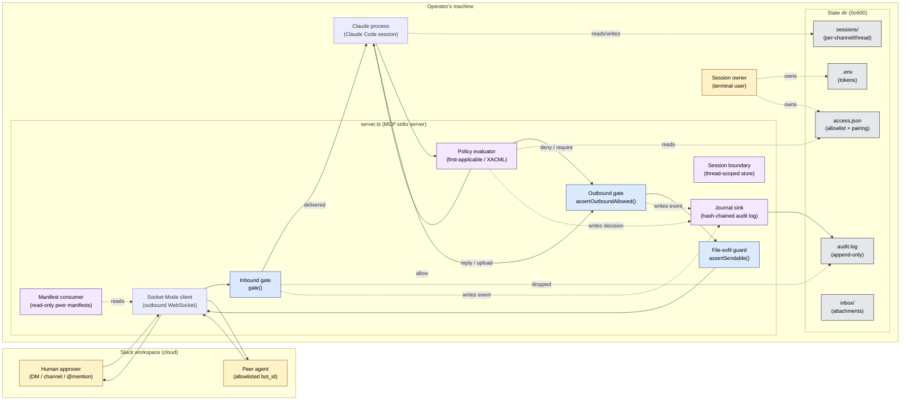

# Architecture

Top-level design reference for `claude-code-slack-channel`. This document names the
components, the trust boundaries between them, and the downstream design docs that
specify each component in detail. It does not replace the README — the README
explains how to run the plugin, this document explains what is running and why the
pieces are separated the way they are.

If you are reading this to understand a specific subsystem, jump to the matching
detail doc:

- **Threat model & trust boundaries** → [`000-docs/THREAT-MODEL.md`](000-docs/THREAT-MODEL.md) *(tracked in [ccsc-k6s](#references))*
- **Session lifecycle** → [`000-docs/session-state-machine.md`](000-docs/session-state-machine.md) *(tracked in ccsc-1gk)*
- **Policy evaluation** → [`000-docs/policy-evaluation-flow.md`](000-docs/policy-evaluation-flow.md) *(tracked in ccsc-nlr)*
- **Audit journal** → [`000-docs/audit-journal-architecture.md`](000-docs/audit-journal-architecture.md) *(tracked in ccsc-hmj)*
- **Bot-manifest protocol** → [`000-docs/bot-manifest-protocol.md`](000-docs/bot-manifest-protocol.md) *(tracked in ccsc-npd)*
- **Security model & reporting** → [`SECURITY.md`](SECURITY.md)
- **Access-control schema** → [`ACCESS.md`](ACCESS.md)

Those docs do not yet all exist — P0.2 is the design-first phase that creates them.
This document is the contract every later doc slots into.

---

## Four-principal model

The plugin mediates between four principals. Naming them here lets every later doc
talk about the same actors without redefining them.

| Principal | Identity | Trusted for | Not trusted for |
|-----------|----------|-------------|-----------------|
| **Session owner** | The human at the terminal where `claude` is running. Owns `~/.claude/channels/slack/` and the Slack tokens. | Setup, pairing decisions, policy authorship, approving tool calls. | Being online — absence must not weaken the other principals. |
| **Claude process** | The Claude Code session that spawned this MCP server over stdio. | Reading its own stdio channel, invoking declared tools. | Reading arbitrary filesystem state, reaching the network outside declared tools, deciding who it is allowed to talk to. |
| **Human approver** | A human speaking through Slack — either the session owner on mobile or an explicitly allowlisted teammate. | Sending messages that become user turns for Claude; approving tool calls when policy requires it. | Being present — their message is just content, not an authorization token. |
| **Peer agent** | Another bot (Claude Code instance, PagerDuty, Zapier, a coworker's agent) posting in a shared channel, opted in via `allowBotIds`. | Delivering structured signals (alerts, handoffs) after opt-in. | Approving tool calls, granting access, or asserting identity beyond their bot user ID — *advertisements are not grants*. |

The invariant every component respects:

> **A message from any principal is content, never authorization.** Identity is
> established before a message reaches the Claude process; nothing inside the
> message body can change who the sender is.

The threat-model doc (`000-docs/THREAT-MODEL.md`) specifies the attack surface
per principal; `SECURITY.md` will host the user-facing summary (epic ccsc-xfj).

---

## Top-level component diagram

The diagram is deliberately minimal — it names every component that a later doc
will specify in detail. Dashed arrows are observability / ownership; solid arrows
are data flow.

---

## Components

### Session boundary

**Where:** `supervisor.ts` (runtime) + `lib.ts` (primitives) + per-thread files
under `~/.claude/channels/slack/sessions/<channel>/<thread>.json`.
**Spec:** `000-docs/session-state-machine.md` (bead ccsc-1gk), implemented by
Epic 32-A (ccsc-z78) and Epic 32-B (ccsc-xa3).

A session is the unit of *conversation state* — scoped to a Slack thread, not a
Slack channel. The boundary exists so that two parallel threads in the same
channel cannot see each other's context. The session boundary:

- Owns `SessionKey` (channel + thread tuple) and `sessionPath()` with realpath
  guard (CWE-22).
- Uses an atomic writer (`tmp + chmod 0o600 + rename`) so partial writes never
  surface a half-written session to a concurrent read.
- Has an **Armstrong-style supervisor** contract (`SessionSupervisor` in
  `supervisor.ts`): the lifecycle is a strict five-state FSM —
  `Nonexistent → Activating → Active → Quiescing → Deactivating → Nonexistent`,
  with a `Quarantined` terminal for save/load failures. There is no
  `Active → Nonexistent` shortcut; every teardown drains through Quiescing so
  the final save lands.
- **Crash recovery is reload-from-disk, not in-memory reconstitution.** The
  supervisor owns a `Map<SessionKey, SessionHandle>`; the map is ephemeral.
  The source of truth is always the on-disk file.

#### Thread isolation (ccsc-xa3.15)

Two sessions in the same channel but different threads must not share outbound
authority. The outbound gate keys on `(channel, thread_ts)` via
`deliveredThreadKey()`; the permission-pairing relay keys on
`(thread_ts, requestId)` via `permissionPairingKey()`. A tool call dispatched
in thread A cannot post into thread B, and an approval clicked in thread A
cannot satisfy a request issued from thread B — each layer enforces the
invariant independently so a failure in one does not silently grant the other.

#### Idle reaper (ccsc-xa3.14)

The supervisor exposes a `reapIdle()` method. One pass finds every `Active`
handle whose `session.lastActiveAt` is older than `SLACK_SESSION_IDLE_MS`
(default **4 hours**) AND has no in-flight tool calls, then drives it through
`quiesce() → deactivate()`. Handles with in-flight work are skipped — the
reaper never pre-empts; in-flight work drains naturally and becomes reap-
eligible on a later tick. Per-session errors are logged as `session.reap_error`
and do not stop the tick, so one quarantined handle cannot starve the rest
of the population.

The reaper is a reapable unit, not a timer: `server.ts` chooses tick
frequency. Tests drive it deterministically via an injected `clock`.

#### Quarantine

A `saveSession()` or `loadSession()` failure puts the handle into the terminal
`Quarantined` state. The supervisor does not auto-retry; a future bead
(Epic 32-B reaper hardening) will file a beads issue with
`(channel, thread, error, timestamp)` for the SO to clear by hand. Quarantined
handles are never reaped, never auto-deactivated, never reloaded.

### Policy evaluator

**Where:** `policy.ts` (to be introduced).
**Spec:** `000-docs/policy-evaluation-flow.md` (bead ccsc-nlr), implemented by
Epic 29-A (ccsc-v1b) and Epic 29-B.

Declarative rules that decide whether a tool call runs, is denied, or requires a
human approver. Evaluation is *pure* — it takes `(call, policies, now)` and returns
a `PolicyDecision` tagged union. Combining algorithm is **first-applicable
(XACML)**; the loader runs a shadow-detection linter at startup and fails closed
on monotonicity violations. Path matchers canonicalize via `realpath` so symlinks
cannot smuggle matches. The evaluator never sees peer-agent manifests — see
*Manifest consumer* below.

### Journal sink

**Where:** audit log file, location chosen by `--audit-log-file` CLI flag or
`SLACK_AUDIT_LOG` env.
**Spec:** `000-docs/audit-journal-architecture.md` (bead ccsc-hmj), implemented
by Epic 30-A (ccsc-5pi) and Epic 30-B.

Append-only, hash-chained log of every security-relevant event: inbound gate
decisions, outbound reply attempts, policy decisions, exfiltration-guard hits.
Hashing follows **Schneier & Kelsey (1999)** — `hash = sha256(prevHash ||
serialized(event))` — so post-hoc tampering is detectable. The journal has zero
Slack surface in v0.4.1 (local only); v0.5.0+ projects filtered events to Slack
via a separate projection. Redaction runs before write for known token
prefixes (`sk-*`, `xoxb-*`, `ghp_*`, `AKIA*`).

### Manifest consumer

**Where:** `slack/read_peer_manifests` MCP tool (to be introduced).
**Spec:** `000-docs/bot-manifest-protocol.md` (bead ccsc-npd), implemented by
Epic 31-A (ccsc-s53) and Epic 31-B, **conditional on upstream A2A adoption or a
Slack signed-message primitive** — the manifest protocol is not shipped until
identity can be verified by something stronger than `bot_id`.

A peer agent publishes a small JSON manifest (< 40 KB) in-channel with magic
header `__claude_bot_manifest_v1__`. The consumer reads these, caches for 5
minutes, and surfaces them to Claude as *information*. The binding invariant is
Miller (2006): **advertisements are not grants** — manifest data is *never*
passed to the policy evaluator. A bot saying "I am an approver" in its manifest
does not make it one; only the access store does.

### Gates (already shipped)

The three security-critical gates already live in `lib.ts`:

- **Inbound gate** (`gate()`): drops every message that is not explicitly allowed
  before it reaches MCP. Bot messages are dropped by default; per-channel
  `allowBotIds` opts specific peer bots in.
- **Outbound gate** (`assertOutboundAllowed()`): restricts `reply` and
  `upload_file` to channels that previously passed the inbound gate.
- **File-exfil guard** (`assertSendable()`): blocks sending files from the state
  directory (`.env`, `access.json`, etc.).

Every new component above must call into — or be called by — an existing gate.
New components never widen the trust boundary; they layer inside it.

---

## Data flow (golden path)

1. Slack posts an event over the outbound-only Socket Mode WebSocket to
   `server.ts`.
2. The **inbound gate** checks channel opt-in, `allowFrom`, `allowBotIds`, and
   self-echo filters; ungated events are dropped and logged to the journal.
3. For delivered events, `server.ts` loads/creates the **session** keyed by
   `(channel, thread_ts)`, then emits an MCP notification to the Claude process.
4. Claude composes a tool call (e.g., `reply`, `upload_file`, or a file edit).
5. The **policy evaluator** inspects the call against authored rules and the
   current session state, returning `allow` / `deny` / `require_approval`.
6. On `require_approval`, the outbound gate asks the human approver in Slack
   and blocks until a reply arrives; on `deny`, the evaluator rejects.
7. The **outbound gate** + **file-exfil guard** validate the response channel
   and any file attachments.
8. The **journal sink** records every decision with its prev-hash link.

A denied or dropped event never reaches step 3; a denied tool call never reaches
step 7. Both outcomes are journaled.

---

## What this architecture is *not*

- **Not an agent framework.** There is no scheduler, no planner, no long-running
  loop inside `server.ts`. Claude Code is the agent; this plugin is plumbing.
- **Not a Slack SDK wrapper.** The Slack WebClient is a dependency, not an
  abstraction. We do not export Slack types; callers get domain types from
  `lib.ts`.
- **Not multi-tenant.** One session owner, one state directory, one Claude
  process. The access store is an allowlist, not an auth provider.
- **Not eventually-consistent.** Every write to the state dir is atomic
  (`tmp + rename`) and every state read is from disk. There is no in-memory
  "truth" that can disagree with `access.json`.

---

## Design-in-public commitment

Every P0.2.x doc listed above exists because the code it describes will ship
next. The ordering is deliberate: the *design* is public before the *code* is
written, so that anyone reviewing a later PR can check it against a frozen
contract instead of reverse-engineering intent from a diff.

When a new epic lands (Epic 29-A, 30-A, 31-A, 32-A, …), the matching doc is
updated in the *same* PR — never in a follow-up. Drift is caught in review, not
after merge. If a doc and code disagree, the code is wrong and reverts; the doc
is the source of truth for security-boundary decisions.

A companion blog post walks through the rationale for outside readers:
**"Designing an AI plugin so it can't own you"** (link will be added here on
publication). The post is not a substitute for this doc — it is a narrative
about *why* the four-principal model and the gate layering matter, aimed at
engineers who want to apply the pattern to their own plugins.

---

## References

- Schneier, B. & Kelsey, J. (1999). *Secure Audit Logs to Support Computer
  Forensics.* ACM TISSEC. — hash-chained journal.
- Miller, M. S. (2006). *Robust Composition: Towards a Unified Approach to
  Access Control and Concurrency Control.* PhD thesis. — "advertisements are
  not grants" invariant on the manifest consumer.
- XACML 3.0 (OASIS, 2013). — first-applicable combining algorithm in the
  policy evaluator.
- Armstrong, J. (2003). *Making reliable distributed systems in the presence
  of software errors.* PhD thesis. — supervisor / lifecycle shape for the
  session boundary.
- Dapper (Sigelman et al., Google, 2010). — sampling-friendly tracing shape
  informing the journal's correlation-id field.

Bead references (in [beads](.beads/)):

- **ccsc-ksm** — this document (P0.2.1).
- **ccsc-k6s** — THREAT-MODEL.md (P0.2.2).
- **ccsc-1gk** — session-state-machine.md (P0.2.3).
- **ccsc-nlr** — policy-evaluation-flow.md (P0.2.4).
- **ccsc-hmj** — audit-journal-architecture.md (P0.2.5).
- **ccsc-npd** — bot-manifest-protocol.md (P0.2.6).
- **ccsc-xfj** — promote four-principal model into SECURITY.md (P0.3).
- **ccsc-z78 / -v1b / -5pi / -s53** — implementing epics that consume this design.
